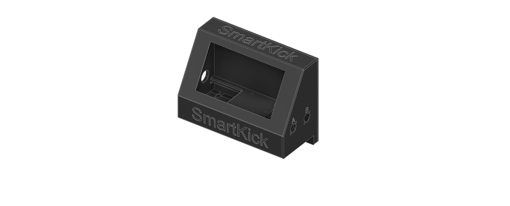
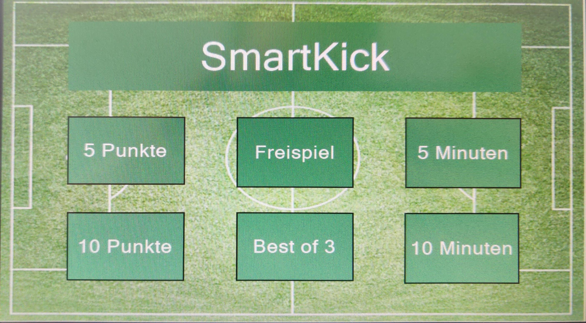

# SmartKick - Intelligente Tischkicker-Zählung

## 🏆 Übersicht

<div align="center">

<br>
<em>SmartKick System - 3D-gedrucktes Gehäuse mit Touch-Display</em>
</div>

**SmartKick** verwandelt jeden Standard-Tischkicker in ein intelligentes Spielsystem mit automatischer Torerkennung und professionellem Touch-Display.

## ✨ Features

### 🎮 **6 Spielmodi**
<div align="center">

<br>
<em>7" Nextion Touch-Display mit intuitiver Bedienung</em>
</div>

- **🆓 Freispiel** - Unbegrenztes Training
- **⏰ Zeitspiel** - 5 oder 10 Minuten mit Countdown
- **🏆 Klassisch** - Erstes Team zu 5 oder 10 Punkten
- **🥇 Best of 3** - Schnelle Entscheidungsspiele

## 🛠️ Hardware-Komponenten

**Professionelle Komponenten für zuverlässigen Betrieb:**
- **7" Nextion Touch-Display** - Intuitive Bedienung
- **Arduino Uno Rev 3** - Zuverlässige Steuerung  
- **IR-Lichtschranken** - 99%+ Torerkennungsrate
- **10.000mAh Powerbank** - 3+ Stunden Spielzeit
- **3D-Gehäuse** - Robust und servicefreundlich

**Gesamtkosten: ~260€** (ohne Personalkosten)

**[→ Detaillierte Teileliste & Verkabelung](docs/HARDWARE.md)**

### 🔋 **Portabel & Robust**
- **3+ Stunden Akkulaufzeit** mit 10.000mAh Powerbank
- **USB-C Laden** während dem Spielen + **Smartphone-Ladefunktion**
- **3D-gedrucktes Gehäuse** - 5mm Wandstärke, Serviceklappe an Rückseite
- **Schlüsselschalter** - Schutz vor unbefugter Nutzung
- **DIN-Steckverbindungen** - modularer Aufbau, einzelne Komponenten tauschbar

### ⚡ **Automatische Torerkennung**
- **IR-Lichtschranken** (Adafruit ADA2168) mit 99%+ Zuverlässigkeit
- **5mm IR-Sensoren** in jedem Tor mit DIN-Anschluss
- **Automatische Kalibrierung** gegen Umgebungslicht
- **Debounce-Algorithmus** filtert Störungen und Vibrationen
- **Manuelle Korrektur** über +/- Buttons möglich

### 🏗️ **Technische Spezifikationen**
- **Betriebstemperatur**: 0°C bis 40°C (Gastronomie-tauglich)
- **Energiebedarf**: Maximal 5V bei 2A
- **Gehäuse**: 100% recycelter Kunststoff, 5mm Wandstärke
- **Überlastschutz**: Automatisches Herunterfahren bei Stromüberlastung
- **Langzeittests**: 100+ Stunden Betrieb erfolgreich getestet
- **Normen**: CE-Norm, VDE 0701-0702 konform

### 🔧 **Nachrüstung & Service**
- **Plug & Play** - keine dauerhafte Installation am Tischkicker
- **Klettverschluss** oder **Schraubverbindung** zur Befestigung
- **Serviceklappe** für einfachen Komponententausch
- **Modularer Aufbau** - defekte Teile einzeln austauschbar

## 🚀 Schnellstart

### 1. **Hardware aufbauen**
```
Arduino → Nextion Display → IR-Sensoren → Powerbank
```
**[→ Detaillierte Hardware-Anleitung](docs/HARDWARE.md)**

### 2. **Software flashen**
```
SmartKick.ino → Arduino IDE → Upload
```
**[→ Software-Installation](docs/SOFTWARE.md)**

### 3. **System starten**
<div align="center">

<br>
<em>Nach dem Start erscheint automatisch das Menü</em>
</div>

- **Powerbank einschalten**
- **USB-C einstecken** 
- **Spielmodus wählen** → Sofort losspielen!

**[→ Vollständige Bedienungsanleitung](docs/USAGE.md)**

## 🎯 Für wen ist SmartKick?

### 🏢 **Unternehmen**
- **Mittagspausen-Turniere** mit fairer Zeitmessung
- **Team-Building Events** mit verschiedenen Modi
- **Pausenraum-Upgrade** ohne dauerhafte Installation

### 🏠 **Privatpersonen**
- **Familien-Matches** mit automatischer Zählung
- **Party-Highlight** mit professionellem Touch
- **Trainings-Tool** für Vereinsspieler

### 🎓 **Bildungseinrichtungen**
- **MINT-Projekt** für Schüler (Arduino + 3D-Druck)
- **Pausenhof-Attraktion** in Schulen
- **Maker-Space Projekt** in Universitäten

## 💡 Warum SmartKick?

### ✅ **Vorteile**
- **Keine Diskussionen** mehr über Spielstand
- **Faire Zeitlimits** für Turniere  
- **Professionelles Feeling** wie bei eSports
- **Portabel** - kein fester Einbau nötig
- **Erweiterbar** - Open Source für eigene Ideen

### 🔧 **Alternativen und Abgrenzung**
- **Strichlisten**: Fehleranfällig, kein Zeitlimit
- **Handy-Apps**: Erfordern manuelle Eingabe
- **Profi-Systeme**: 500-2000€, fest installiert
- **SmartKick**: Automatisch + mobil + günstig

## 📖 Dokumentation

### 🎮 **Benutzer**
- **[📱 Bedienungsanleitung](docs/USAGE.md)** - Touch-Display, alle Spielmodi
- **[❓ FAQ & Troubleshooting](docs/USAGE.md#problemlösungen)** - Häufige Probleme lösen

### 🛠️ **Bastler & Entwickler**  
- **[🔧 Hardware-Setup](docs/HARDWARE.md)** - Schaltplan, Verkabelung, 3D-Druck
- **[💻 Software-Details](docs/SOFTWARE.md)** - Code-Struktur, Anpassungen
- **[⌨️ Serielle Konsole](docs/CONSOLE.md)** - Erweiterte Konfiguration

## 🔮 Roadmap & Erweiterungen

### 🎯 **Geplante Features**
- **🌐 WiFi-Integration** - Online-Ranglisten
- **📊 Statistiken** - Langzeit-Auswertungen  
- **🎵 Sound-Effekte** - Tor-Jingles und Hintergrundmusik
- **📷 Tor-Kamera** - Replay-Funktion für umstrittene Situationen

### 🛡️ **Known Issues**
- **IR-Sensoren** gelegentlich empfindlich bei direktem Sonnenlicht
- **Touch-Display** benötigt festen Druck (kapazitiver Touchscreen)
- **Akkulaufzeit** variiert je nach Display-Helligkeit

## 🤝 Community & Support

### 💬 **Hilfe & Diskussion**
- **Issues** - Bug-Reports und Feature-Requests
- **Wiki** - Community-Erweiterungen und Tipps
- **Releases** - Stable Versionen und Updates

### 🎁 **Beitragen**
- **Code-Verbesserungen** via Pull-Requests
- **Dokumentation** erweitern und korrigieren
- **3D-Gehäuse** alternative Designs teilen
- **Fotos & Videos** vom eigenen SmartKick

## 📄 Lizenz

**MIT License** - Frei verwendbar für private und kommerzielle Projekte.

---

## ⭐ **SmartKick gefällt dir?**

<div align="center">

**🌟 Star das Repository** • **🍴 Fork für eigene Projekte** • **📢 Teilen mit Freunden**

*Verwandle auch deinen Tischkicker in ein Smart-System!*

</div>

---

**Navigation**: **Hardware** → [Hardware Setup](docs/HARDWARE.md) | **Software** → [Software Details](docs/SOFTWARE.md) | **Bedienung** → [Usage Guide](docs/USAGE.md)
