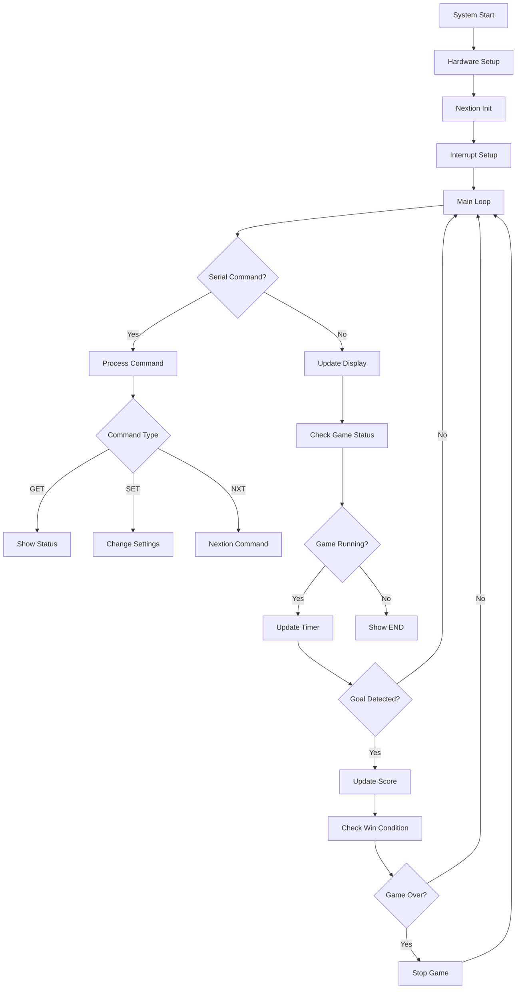

# Software Dokumentation

## 🏗️ Software-Architektur

### Überblick
Das SmartKick System basiert auf einer ereignisgesteuerten Architektur mit drei Hauptkomponenten:
- **Arduino Controller** - Hauptlogik und Sensor-Verarbeitung
- **Nextion Display** - Benutzeroberfläche und Visualisierung  
- **Serielle Konsole** - Debug und erweiterte Steuerung

### Globale Datenstrukturen
- **configArray[4]** - Spielkonfiguration (Zeit, Tore, Modus, Status)
- **scoreArray[4]** - Spielstand (Team1, Team2, Reserved, GameEnd)
- **teamNames[2]** - Namen der beiden Teams
- **interruptData[4]** - Zeitstempel für Sensor-Entprellung

### Debug-System
Drei Debug-Level für unterschiedliche Detailgrade:
- **Level 0**: Nur kritische Systemmeldungen
- **Level 1**: Wichtige Spielereignisse (Standard)
- **Level 2**: Ausführliche Protokollierung aller Aktionen

## 📊 Systemfluss



## 🔧 Installation & Setup

### 1. Arduino IDE vorbereiten

#### Software-Anforderungen
- **Arduino IDE**: Version 1.8.19 oder neuer
- **AltSoftSerial Library**: Für Nextion-Kommunikation

#### Library Installation
```bash
# Via Arduino IDE Library Manager:
1. Sketch → Include Library → Manage Libraries
2. Suche nach "AltSoftSerial"
3. Installiere "AltSoftSerial by Paul Stoffregen"

# Oder via Arduino CLI:
arduino-cli lib install "AltSoftSerial"
```

### 2. Code Upload

#### Via Arduino IDE:
1. **SmartKick.ino** öffnen
2. **Board auswählen**: Tools → Board → Arduino Uno
3. **Port auswählen**: Tools → Port → COM3 (oder entsprechender Port)
4. **Upload**: Ctrl+U oder Upload-Button

#### Via Arduino CLI (optional):
```bash
arduino-cli compile --fqbn arduino:avr:uno SmartKick.ino
arduino-cli upload -p COM3 --fqbn arduino:avr:uno SmartKick.ino
```

### 3. Nextion Display Setup

#### HMI-Projekt laden
📁 **[Nextion HMI Datei](../Nextion%20HMI/Kicker.HMI)**

1. **Nextion Editor** herunterladen und installieren
2. **Kicker.HMI** im Editor öffnen
3. **Kompilieren** zu .tft Datei
4. **Upload** auf Display:
   - Via SD-Karte: .tft auf SD → in Display einlegen → Power On
   - Via USB: Debug → Upload über USB

#### Display-Konfiguration
```
Baudrate: 9600
Befehlsformat: COMMAND\xFF\xFF\xFF (drei 0xFF Bytes als Terminator)
```

### 4. Erste Inbetriebnahme

#### Serieller Monitor
1. **Baudrate**: 115200
2. **Line Ending**: Both NL & CR
3. **Startup-Check**:
```
SmartKick
=== SPIELSTAND ===
Team 1: 0
Team 2: 0
Modus: Freies Spiel
Zeit: 00:00
```

#### System-Test
```
get config          # Konfiguration anzeigen
set debug 2         # Debug-Level erhöhen
set nextion on      # Display aktivieren

# Funktionstest:
set name1 Test1
set name2 Test2
set mode time
set time 2
set start
```

## 🔧 Funktionsübersicht

### Setup & Initialization

#### `setup()`
- Serielle Kommunikation initialisieren (115200 Baud)
- Pin-Modi konfigurieren (INPUT_PULLUP für Sensoren)
- RGB-LED initialisieren (optional, Debug-Zwecke)
- Nextion Display verbinden (9600 Baud)
- Interrupt-Handler für Torsensoren aktivieren
- Willkommensnachricht ausgeben

### Hauptschleife

#### `loop()`
- Serielle Befehle verarbeiten und weiterleiten
- Nextion-Display kontinuierlich aktualisieren
- Spielzeit verwalten (vorwärts/rückwärts je nach Modus)
- Spielende-Bedingungen prüfen
- Status-Ausgaben im 5-Sekunden-Rhythmus

### Sensor-Verarbeitung

#### Interrupt Handler (`goalTeam1()`, `goalTeam2()`)
- Sofortige Reaktion auf Sensor-Ereignisse
- Zeitstempel für Entprellung speichern
- Team-spezifische Flags setzen
- Minimale Verarbeitung (Interrupt-Regel)

#### Entprellung (`debounce()`)
- Mehrfacherkennung vermeiden (Mindestabstand 500ms)
- Gültige Tore von Störsignalen unterscheiden
- Debug-Ausgaben für Sensor-Events
- Boolesche Rückgabe für Tor-Validierung

### Befehlsverarbeitung

#### `processCommand()`
- Eingabe-String analysieren und Befehlstyp erkennen
- Routing an spezialisierte Handler-Funktionen
- Debug-Ausgaben für alle verarbeiteten Befehle
- Fehlerbehandlung für unbekannte Befehle

#### `handleGetCommand()` / `handleSetCommand()`
- GET: Status-Informationen formatiert ausgeben
- SET: Konfigurationsänderungen durchführen
- Parameter-Validierung und Bereichsprüfungen
- Nextion-Display bei Änderungen aktualisieren

### Display-Kommunikation

#### `updateNextion()`
- Regelmäßige Display-Updates (alle 100ms)
- Spielstand, Zeit, Namen und Modus übertragen
- Nur bei Änderungen senden (Effizienz)
- Status-abhängige Anzeige (laufend/beendet)

#### `sendToNextion()`
- Einzelne Befehle an Display senden
- Nextion-Protokoll mit Terminator-Bytes
- Debug-Ausgabe aller gesendeten Befehle
- Aktivierungs-Check (Display kann deaktiviert werden)

## 🎮 Spiel-Management

### Spielmodi-Logik

#### Freies Spiel (MODE_FREE)
- Zeit läuft vorwärts ohne Limit
- Kein automatisches Spielende
- Manueller Reset erforderlich

#### Zeitspiel (MODE_TIME)
- Countdown von eingestellter Zeit
- Automatisches Ende bei 0:00
- Gewinner = Team mit mehr Toren

#### Klassisches Spiel (MODE_CLASSIC)
- Zeit läuft vorwärts
- Ende bei erreichter Torzahl
- Sofortiger Sieg beim Torziel

### Spiel-Steuerung

#### `startGame()`
- Spielstand auf 0:0 zurücksetzen
- Spielzeit je nach Modus initialisieren
- Status auf "laufend" setzen
- LED-Feedback (optional, grün blinken)

#### `stopGame()` / `resetGame()`
- Status auf "gestoppt" setzen
- Zeit einfrieren (stopGame) oder zurücksetzen (resetGame)
- Display entsprechend aktualisieren

#### `checkGameEnd()`
- Kontinuierliche Prüfung der Siegbedingungen
- Automatisches Spielende auslösen
- Gewinner-Anzeige und Celebration-Effekte

### RGB-LED Debug (Optional)

#### Feedback-System
- **Blau**: Tor für Team 1
- **Rot**: Tor für Team 2
- **Grün**: Spielstart/Spielende
- **Aus**: Normaler Betrieb

#### `RGBLED` Klasse
- Pin-Konfiguration für Common-Cathode RGB-LED
- Farbsteuerung mit PWM (analogWrite)
- Blink-Funktionen für Events
- Ausschaltfunktion für stromsparenden Betrieb

## 🔍 Debug & Troubleshooting

### Debug-Level Verwendung
```
set debug 0  // Nur kritische Meldungen
set debug 1  // Standard: Spielereignisse + kritisch
set debug 2  // Ausführlich: Alle Befehle + Events
```

### Typische Debug-Ausgaben

**Debug Level 1 (Empfohlen):**
```
SmartKick gestartet
Tor für Team 1
Spielstand: Team 1: 1, Team 2: 0
Spiel gestartet
Zeitspiel beendet - Zeit abgelaufen
```

**Debug Level 2 (Entwicklung):**
```
Verarbeite Befehl: 'set mode time'
HandleSetCommand mit Parameter: mode time
Spielmodus auf Zeitspiel gesetzt
Nextion: t4.txt="Zeitspiel"
Interrupt Tor 1 - Zeit seit letztem: 1250ms
```

### Häufige Probleme & Lösungsansätze

| Problem | Debug-Hinweise | Lösung |
|---------|----------------|--------|
| **Keine Seriellen Daten** | Keine Ausgabe im Monitor | Baudrate 115200 prüfen |
| **Display reagiert nicht** | "Nextion: ..." fehlt in Debug | RX/TX Pins prüfen, HMI neu laden |
| **Doppelte Tore** | Interrupt-Spam im Debug Level 2 | Entprellungszeit erhöhen |
| **Zeit läuft nicht** | Game Status = 0 in get config | `set start` ausführen |
| **RGB-LED funktioniert nicht** | Keine LED-Meldungen | Pin-Belegung und Vorwiderstände prüfen |

### Memory-Optimierung
- String-Konstanten im Flash-Speicher (F-Makro)
- Vermeidung von dynamischen String-Operationen
- Effiziente Array-Nutzung statt Objekte
- Minimale Interrupt-Verarbeitung

## 📁 Code-Struktur

### Datei-Übersicht
```
SmartKick.ino                 # Hauptdatei (~800 Zeilen)
├── Includes & Defines        # Libraries und Konstanten
├── Global Variables          # Arrays und Objektinstanzen
├── RGBLED Class             # LED-Steuerung (optional)
├── Setup Function           # Hardware-Initialisierung
├── Main Loop               # Hauptschleife
├── Command Processing      # Serielle Befehlsverarbeitung
├── Game Management        # Spiellogik und Timer
├── Display Functions      # Nextion-Kommunikation
├── Sensor Functions       # Interrupt-Handler und Entprellung
└── Helper Functions       # Utility-Funktionen
```

### Speicherverbrauch (Typisch)
```
Sketch verwendet ~24KB (74%) des Programmspeicherplatzes
Globale Variablen verwenden ~1.2KB (59%) des dynamischen Speichers
```

### Erweiterungsmöglichkeiten
- **WiFi-Modul**: ESP32 statt Arduino für Online-Features
- **SD-Karte**: Persistente Speicherung von Spielständen
- **Bluetooth**: Mobile App-Anbindung
- **Sound-Modul**: Akustische Effekte bei Toren
- **Weitere Sensoren**: Ballgeschwindigkeit, Spielerposition

## 🔗 Nextion Display Integration

### Display-Felder (Technical Reference)
```
t0.txt  - Titel/Logo
t1.txt  - Zeit (MM:SS Format)
t2.txt  - Team 1 Name
n0.val  - Team 1 Score (Numerisch)
t3.txt  - Team 2 Name
n1.val  - Team 2 Score (Numerisch)
t4.txt  - Spielmodus-Anzeige
```

### Kommunikationsprotokoll
- **Baudrate**: 9600 (AltSoftSerial Standard)
- **Format**: ASCII-Befehle mit 3x 0xFF Terminator
- **Update-Rate**: 100ms für flüssige Anzeige
- **Fehlerbehandlung**: Timeout und Retry-Mechanismus

### HMI-Entwicklung
Das Nextion HMI-Projekt kann im Nextion Editor bearbeitet werden:
- **Seiten**: Hauptanzeige, Menü, Einstellungen
- **Events**: Touch-Events für Button-Interaktion
- **Animationen**: Tor-Effekte und Übergänge
- **Anpassung**: Farben, Fonts, Layout individualisierbar

---

**Weiter zu**: [Bedienungsanleitung →](USAGE.md) | **Zurück zu**: [Hardware Setup ←](HARDWARE.md)

## 🎯 Projektspezifische Features

### Implementierte Pflichtenheft-Anforderungen
- **Automatische Kalibrierung**: IR-Sensoren self-adjusting
- **Debounce-Algorithmus**: Störungsfilterung (500ms Standard)
- **Überlastschutz**: Automatisches Herunterfahren bei Stromüberlast
- **Modulare Architektur**: DIN-Steckverbindungen für Wartung

### Optionale Features (Erweiterbar)
- **MP3-Interface**: Vorbereitet für akustische Signale
- **Helligkeitsregelung**: Automatische Anpassung an Umgebungslicht
- **Schlüsselschalter-Integration**: Pin-basierte Aktivierung