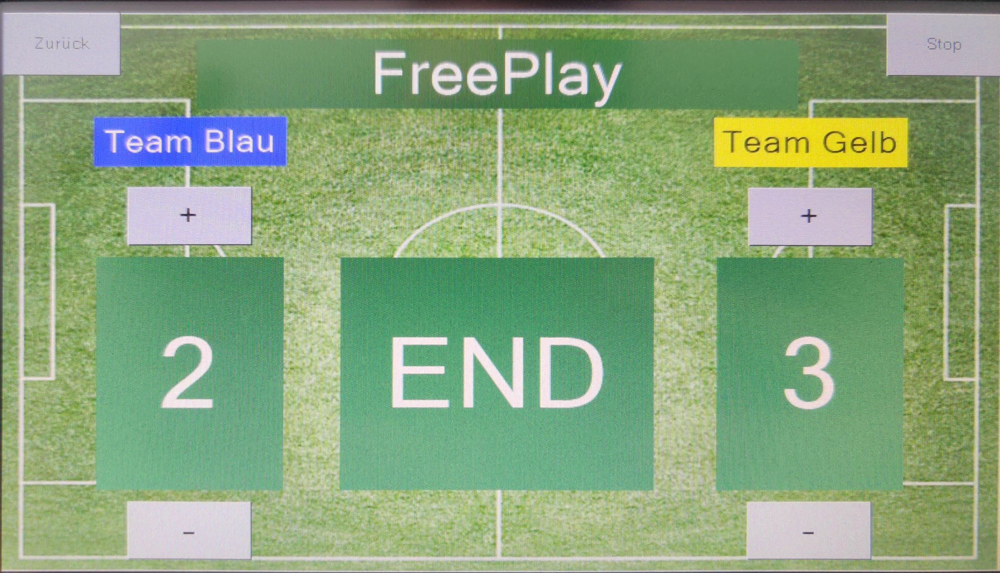
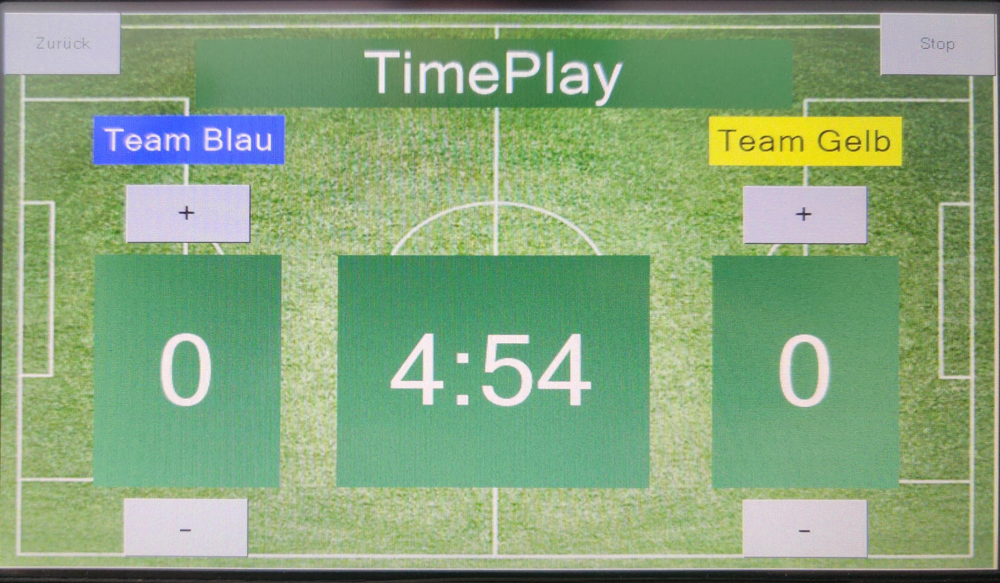
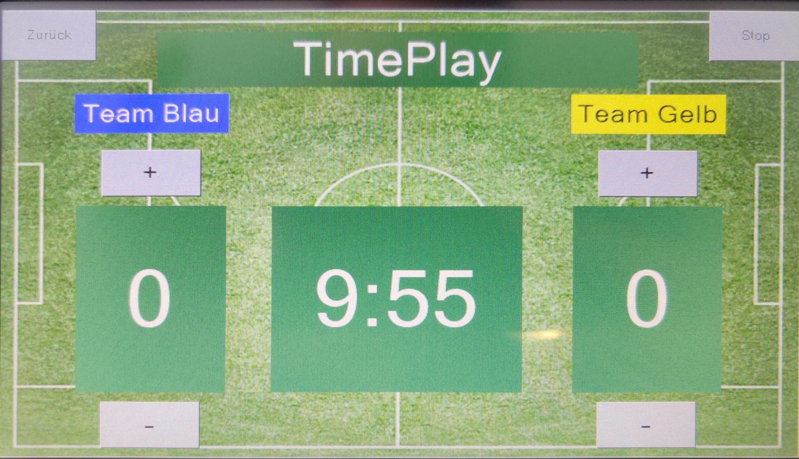
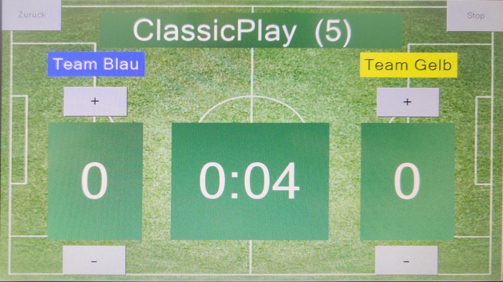
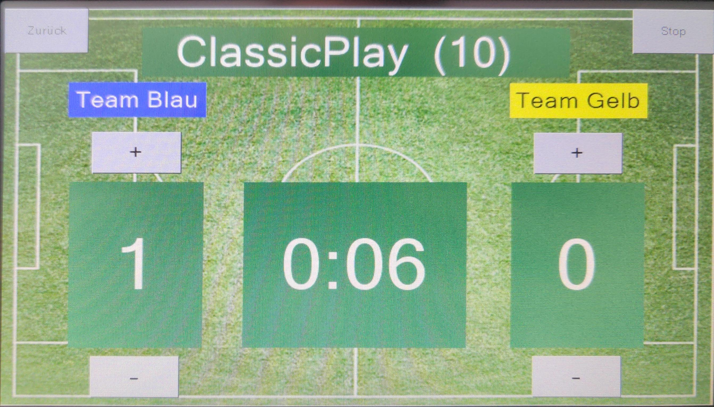
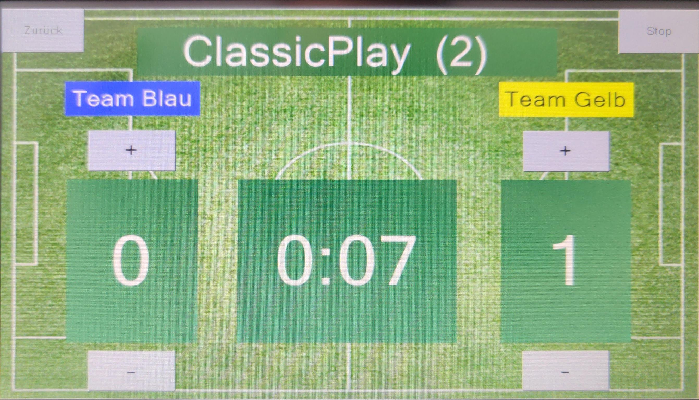

# Bedienungsanleitung

## 🎮 Spielmodi

### 1. 🆓 Freispiel
**Für**: Lockeres Spielen, Übung, Tests

 
<em>Touch-Display im Freispiel Modus</em>

**Eigenschaften:**
- ⏱️ **Zeit**: Läuft vorwärts (Elapsed Time)
- 🎯 **Ziel**: Kein automatisches Spielende
- 🏆 **Gewinner**: Manuell bestimmen
- 🔄 **Reset**: Über Menü möglich

**So startest du:**
1. **"MENÜ"** antippen
2. **"Freispiel"** wählen
3. Automatischer Start
4. Spielen bis ihr fertig seid

### 2. ⏰ Zeitspiel (5 oder 10 Minuten)
**Für**: Turnier-Matches, faire Wettkämpfe

 
<em>5-Minuten Zeitspiel mit Countdown-Timer</em>

 
<em>10-Minuten Zeitspiel mit Countdown-Timer</em>

**Verfügbare Zeiten:**
- **"5 Minuten"** - Schnelle Runden
- **"10 Minuten"** - Standard-Matches

**Eigenschaften:**
- ⏱️ **Zeit**: Countdown von 5:00 oder 10:00 bis 0:00
- 🎯 **Ziel**: Mehr Punkte bis Zeitablauf
- 🏆 **Gewinner**: Team mit höherem Score bei 0:00
- 🔄 **Ende**: Automatisch bei Zeitablauf

**So startest du:**
1. **"MENÜ"** antippen
2. **"5 Minuten"** oder **"10 Minuten"** wählen
3. Countdown startet automatisch
4. Bei 0:00 wird der Gewinner angezeigt

### 3. 🏆 Klassisches Spiel (5 oder 10 Punkte)
**Für**: Traditionelle Tischkicker-Matches

 
<em>Klassisches Spiel bis 5 Punkte</em>

 
<em>Klassisches Spiel bis 10 Punkte</em>

**Verfügbare Punktziele:**
- **"5 Punkte"** - Schnelle Spiele
- **"10 Punkte"** - Standard-Matches

**Eigenschaften:**
- ⏱️ **Zeit**: Läuft vorwärts (unbegrenzt)
- 🎯 **Ziel**: Erstes Team mit 5 oder 10 Punkten gewinnt
- 🏆 **Gewinner**: Sofort bei Punktziel
- 🔄 **Ende**: Automatisch bei Siegpunkten

**So startest du:**
1. **"MENÜ"** antippen
2. **"5 Punkte"** oder **"10 Punkte"** wählen
3. Spiel startet automatisch
4. Automatisches Spielende bei Punktziel

### 4. 🥇 Best of 3
**Für**: Entscheidende Matches

 
<em>Best of 3 Modus (= Spiel bis 2 Punkte)</em>

**Eigenschaften:**
- ⏱️ **Zeit**: Läuft vorwärts (unbegrenzt)
- 🎯 **Ziel**: Erstes Team mit 2 Punkten gewinnt
- 🏆 **Gewinner**: Sofort bei 2 Punkten
- 🔄 **Ende**: Automatisch bei 2 Punkten

**So startest du:**
1. **"MENÜ"** antippen
2. **"Best of 3"** wählen
3. Spiel startet automatisch
4. Automatisches Ende bei 2 Punkten

**Hinweis**: Dies ist technisch ein klassisches Spiel bis 2 Punkte, symbolisch für Best of 3 Sätze benannt.

### 📊 Spielmodus-Übersicht

| Modus | Parameter | Spielende | Ideal für |
|-------|-----------|-----------|-----------|
| **🆓 Freispiel** | Unbegrenzt | Manuell | Training, Spaß |
| **⏰ 5 Minuten** | 5:00 Countdown | Automatisch | Schnelle Runden |
| **⏰ 10 Minuten** | 10:00 Countdown | Automatisch | Standard-Turniere |
| **🏆 5 Punkte** | Erste 5 Punkte | Automatisch | Kurze Matches |
| **🏆 10 Punkte** | Erste 10 Punkte | Automatisch | Klassisch |
| **🥇 Best of 3** | Erste 2 Punkte | Automatisch | Kurze Entscheidung |

## 📱 Touch-Display Bedienung

### Hauptbildschirm (Während des Spiels)

 
<em>Hauptanzeige während des Spiels - Beispiel: 5 Punkte Modus</em>

**Display-Elemente (wie in den Screenshots):**
- 🏆 **"SmartKick"** - Logo/Titel oben
- ⏰ **Zeit-Anzeige** - Format abhängig vom Modus
  - Freispiel: Verstrichene Zeit "2:15"
  - Zeitspiel: Countdown "4:45"
  - Klassisch: Verstrichene Zeit "1:30"
- 👥 **"Team Blau: X"** - Team 1 Name und Punktzahl links
- 👥 **"Team Gelb: X"** - Team 2 Name und Punktzahl rechts
- 🎮 **Modus-Anzeige** - Unten (z.B. "ClassicPlay (5)")

**Touch-Bereiche im Spiel:**
- **"+"** Buttons - Punkt manuell hinzufügen (Korrektur)
- **"-"** Buttons - Punkt abziehen (Fehlerkorrektur)
- **"STOP"** Button - Spiel pausieren
- **"MENÜ"** Button - Zurück zum Menü

### Menü-Bildschirm

 
<em>Einstellungsmenü mit 6 vordefinierten Optionen</em>

**Verfügbare Optionen (exakt wie im Screenshot):**

#### 🎮 Spielmodus-Auswahl
- **"5 Punkte"** - Klassisches Spiel bis 5 Punkte
- **"10 Punkte"** - Klassisches Spiel bis 10 Punkte
- **"Freispiel"** - Unbegrenztes Spiel
- **"Best of 3"** - Spiel bis 2 Punkte
- **"5 Minuten"** - 5-Minuten Zeitspiel
- **"10 Minuten"** - 10-Minuten Zeitspiel

#### 🔙 Navigation
- **"ZURÜCK"** - Zum aktuellen Spiel (falls aktiv)

## 🎯 Praktische Beispiele

### 🏆 Schnelles 5-Minuten Match

 
<em>5-Minuten Setup - Countdown läuft bereits</em>

**Einfachste Bedienung:**
1. **"MENÜ"** antippen
2. **"5 Minuten"** wählen (wie im Menü-Screenshot)
3. ✅ **Countdown startet automatisch!**
4. Nach 5:00 Minuten automatisches Ende

### 🎮 Standard 5-Punkte Spiel

 
<em>Klassisches Match - Team Blau führt bereits</em>

**Klassisches Kicker-Match:**
1. **"MENÜ"** antippen  
2. **"5 Punkte"** wählen
3. ✅ **Display zeigt "ClassicPlay (5)"**
4. Spiel läuft bis erstes Team 5 Punkte hat

### 🏅 10-Punkte Match

 
<em>Längeres klassisches Spiel</em>

**Für traditionelle Matches:**
1. **"MENÜ"** antippen
2. **"10 Punkte"** wählen
3. ✅ **Display zeigt "ClassicPlay (10)"**
4. Spiel bis erstes Team 10 Punkte erreicht

### 🥇 Best of 3 Finale

 
<em>Entscheidungsspiel - nur 2 Punkte nötig</em>

**Für wichtige Entscheidungen:**
1. **"MENÜ"** antippen
2. **"Best of 3"** wählen
3. ✅ **Spiel bis 2 Punkte!**
4. Schnelle Entscheidung

### 🆓 Lockeres Training

 
<em>Unbegrenztes Spiel ohne Zeitdruck</em>

**Für Übung ohne Druck:**
1. **"MENÜ"** antippen
2. **"Freispiel"** wählen
3. ✅ **Unbegrenzt spielen!**
4. **"STOP"** wenn ihr fertig seid

## 🔧 Spielstand-Korrektur

### ⚽ Punkt manuell hinzufügen/entfernen

 
<em>Plus/Minus Buttons sichtbar neben den Punkteständen</em>

**Falls ein Tor nicht erkannt wurde:**
1. **"+"** Button beim entsprechenden Team antippen
2. Spielstand wird sofort korrigiert (z.B. Team Blau: 2 → 3)
3. Spiel läuft normal weiter

**Falls ein Tor fälschlicherweise gezählt wurde:**
1. **"-"** Button beim entsprechenden Team antippen  
2. Spielstand wird korrigiert (z.B. Team Gelb: 1 → 0)
3. Spiel läuft normal weiter

## 💡 Display-Details aus Screenshots

### 🎮 Spielmodus-Anzeige (Unten)
**Format der Modus-Anzeige:**
- **"ClassicPlay (5)"** = 5 Punkte Spiel (siehe Screenshot)
- **"ClassicPlay (10)"** = 10 Punkte Spiel
- **"FreePlay"** = Freispiel
- **"Best of 3"** = Best of 3
- **"TimePlay (5)"** = 5-Minuten Zeitspiel
- **"TimePlay (10)"** = 10-Minuten Zeitspiel

### ⏰ Zeit-Format (abhängig vom Modus)
- **Verstrichene Zeit**: "1:45" = 1 Minute 45 Sekunden gespielt
- **Countdown**: "4:15" = 4 Minuten 15 Sekunden verbleibend
- **Format**: Immer MM:SS (Minuten:Sekunden)

### 👥 Team-Anzeige
- **Team Links**: "Team Blau: 2" (Name : Punkte)
- **Team Rechts**: "Team Gelb: 1" (Name : Punkte)
- **Standard-Namen**: "Team Blau" und "Team Gelb"
- **Namensänderung**: Nur über serielle Konsole möglich

### 🔧 Button-Layout
**Sichtbar in allen Screenshots:**
- **+/- Buttons**: Neben jedem Teamnamen für Korrekturen
- **STOP Button**: Zum Pausieren
- **MENÜ Button**: Zurück zum Menü (unten rechts)

---

*LED-Lichtshow und automatische Animationen sind nicht implementiert*

## 🔧 Problemlösungen

### ❌ Display reagiert nicht
**Lösungsschritte:**
1. **5 Sekunden warten** - System kann beschäftigt sein
2. **Fester antippen** - Touch muss deutlich sein
3. **Powerbank prüfen** - Ist noch Akku da?
4. **Neustart** - USB-C kurz abstecken

### ⚽ Tor nicht erkannt
**Sofort-Lösung:**
1. **"+"** Button beim entsprechenden Team antippen (wie in Screenshots sichtbar)
2. Spielstand ist korrigiert
3. Weiterspielen

### 🔄 Falscher Spielmodus
**Spielmodus ändern:**
1. **"STOP"** antippen
2. **"MENÜ"** antippen (wie im Screenshot gezeigt)
3. Gewünschten Modus neu wählen
4. Spiel startet automatisch neu

## 🔧 Spielende-Verhalten

**Bei automatischem Spielende:**
- 🏆 **Kurze Gewinner-Anzeige** auf dem normalen Spielbildschirm
- ⏱️ **Endstand bleibt sichtbar** (z.B. "Team Blau: 5, Team Gelb: 3")
- 📱 **Automatischer Rücksprung zum Menü** nach wenigen Sekunden
- 🔄 **Neues Spiel** über Menü-Auswahl starten

**Spielende-Situationen:**
- **Zeitspiel**: Bei 0:00 automatisch zum Menü
- **Klassisch**: Bei Erreichen der Punktzahl (5 oder 10) zum Menü  
- **Best of 3**: Bei 2 Punkten automatisch zum Menü
- **Freispiel**: Nur manuell über "STOP" → "MENÜ"

## 🚀 System starten

### Beim Einschalten

 
<em>Nach dem Booten erscheint direkt das Menü</em>

**Startvorgang:**
1. **Powerbank einschalten** (Button drücken)
2. **USB-C einstecken** (ins SmartKick Gehäuse)
3. **5-10 Sekunden warten** (System startet)
4. **Menü erscheint automatisch** (wie im Screenshot)
5. **Spielmodus wählen** → Spiel startet sofort

## 🔧 Spiel-Steuerung

### ⏸️ Spiel pausieren
- **"STOP"** Button antippen (sichtbar in allen Spiel-Screenshots)
- **Spiel pausiert** - Zeit und Punkte bleiben stehen
- **"MENÜ"** antippen → Zurück zur Modus-Auswahl
- **Neuen Modus wählen** → Spiel startet automatisch neu

### 🔄 Spiel beenden
- **Automatisch**: Bei Spielende → automatisch zum Menü
- **Manuell**: "STOP" → "MENÜ" → neuen Modus wählen
- **Sofort-Neustart**: Gleichen Modus erneut wählen

### 📱 Navigation
- **"MENÜ"** Button ist in jedem Spiel verfügbar (unten rechts in Screenshots)
- **Spiel wird pausiert** beim Menü-Aufruf
- **"ZURÜCK"** im Menü → zum pausierten Spiel (falls vorhanden)
- **Neuer Modus** → startet sofort neu (überschreibt pausiertes Spiel)

## 💡 Workflow-Tipps

### 🎮 Schneller Spielwechsel
1. **Aktuelles Spiel läuft** (z.B. "ClassicPlay (5)")
2. **"MENÜ"** antippen
3. **Anderen Modus wählen** (z.B. "10 Minuten")
4. ✅ **Neues Spiel startet sofort!**

### 🔄 Gleichen Modus wiederholen
1. **Spiel zu Ende** → automatisch im Menü
2. **Gleichen Modus erneut antippen** (z.B. "5 Punkte")
3. ✅ **Sofort neues Match 0:0!**

### 🏆 Turnier-Modus
1. **Einmal Modus festlegen** (z.B. "5 Minuten")
2. **Nach jedem Spiel**: Automatisch zurück zum Menü
3. **"5 Minuten" erneut antippen** → nächstes Match
4. **Konsistente Bedienung** für alle Teilnehmer

## ❓ Häufige Fragen (Angepasst)

**Q: Was passiert nach einem Spielende?**  
A: Automatischer Rücksprung zum Menü. Einfach gewünschten Modus erneut wählen für neues Spiel.

**Q: Gibt es einen Game-Over Screen?**  
A: Nein, das System springt direkt zurück zum Menü. Der Endstand ist kurz auf dem Spielbildschirm sichtbar.

**Q: Wie starte ich das System?**  
A: Nach dem Einschalten erscheint automatisch das Menü. Einfach gewünschten Spielmodus antippen.

**Q: Kann ich ein pausiertes Spiel fortsetzen?**  
A: Ja, mit "ZURÜCK" im Menü. Oder neuen Modus wählen für kompletten Neustart.

**Q: Wie schnell kann ich zwischen Spielen wechseln?**  
A: Sehr schnell! Spielende → automatisch im Menü → neuen Modus antippen → sofortiger Start.

---

## 🛠️ Erweiterte Einstellungen (Optional)

*Für erweiterte Konfiguration (individuelle Zeiten, Teamnamen, Debug-Funktionen) gibt es eine serielle Konsole-Steuerung (115200 Baud). Diese ist für den normalen Touch-Betrieb nicht erforderlich.*

**[→ Serielle Konsole Details](./CONSOLE.md)** (Separate Datei für Entwickler)

---

**Zurück zu**: [← Hauptdokumentation](../README.md) | **Hardware**: [Hardware Setup →](HARDWARE.md) | **Software**: [Software Details →](SOFTWARE.md)